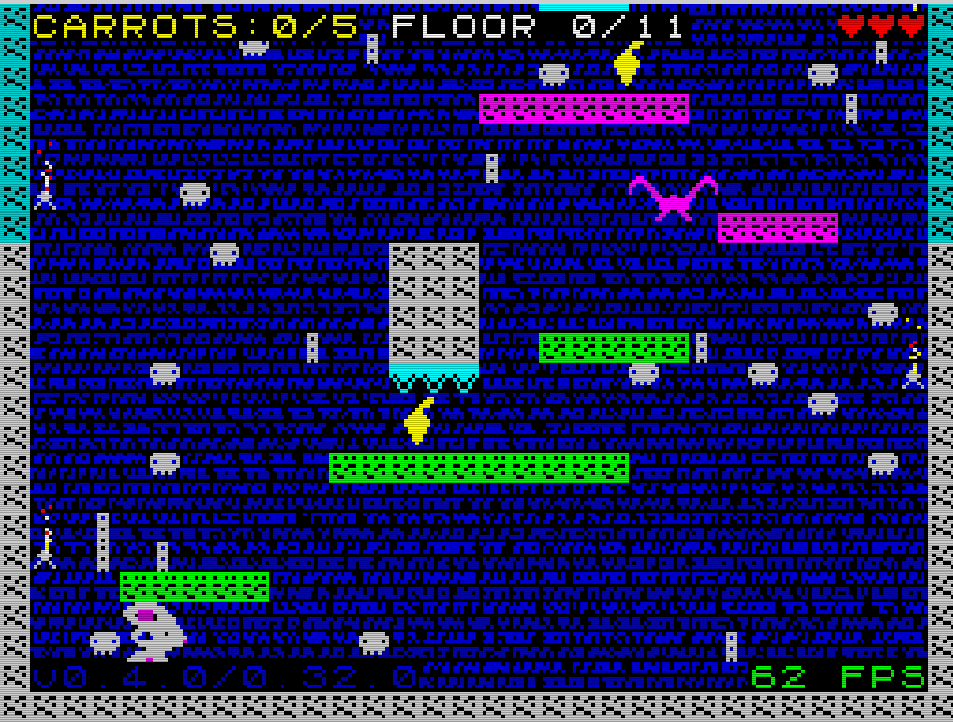

# ZX-KIT Player

A lightweight, data-driven browser player for three-channel AY music with an optional, independent ZX beeper track, written with [`zx-kit`](https://www.npmjs.com/package/zx-kit).

Songs can be hand-authored JSON arrangements or PSG register dumps. JSON songs build three AY tracks—channels **A**, **B**, and **C**—from named patterns and arrangements, and may declare a separate one-bit beeper track that plays in parallel as a "fake" fourth voice without changing the AY emulation. PSG songs use a channelised AudioWorklet based on the `zx-kit` `aydump` core for raw AY chip register streams.



## Features

- One JSON file per song in `songs/`.
- PSG register-dump playback through `zx-kit` `loadPSG()` and a channelised `aydump` AudioWorklet.
- PT3 files are listed as source material and must be converted offline to PSG before playback.
- Automatically generated song catalogue for the dropdown menu.
- Separate **Play** and **Stop** controls.
- Live monitor for AY channels A/B/C and the optional beeper track.
- Per-channel **MUTE** and exclusive **SOLO** controls for JSON, PSG, and ambulance playback.
- Runtime MONO, ACB, and ABC stereo selection.
- Full `zx-kit` AY notes: per-note duration, amplitude, noise period, hardware envelope shape, and envelope cycle.
- Optional per-channel stereo pan.
- Optional pattern/arrangement-driven beeper track using `zx-kit`'s independent `beep()` path.
- Pattern-level timeline visualisation: active pattern, pass, step, token, tone/noise/rest, volume, and envelope.
- No frontend build tool or framework required.
- Formatting enforced with Prettier.
- Reproducible source archives via `npm run archive`.

## Requirements

- Node.js 22 or newer (required by the development dependency on `zx-kit`).
- A modern browser with ES modules, `fetch()`, Web Audio support, and JavaScript enabled.
- An HTTP server for local development. Opening the page directly with `file://` will not work because browsers block JSON loading via `fetch()` in that context.

The player imports the pinned `zx-kit` module from jsDelivr at runtime. The browser therefore needs internet access when the player is opened, unless you later replace that CDN import with a locally bundled copy.

## Quick Start

Install the locked development dependencies:

```bash
npm ci
```

Generate the song catalogue and start a local static server:

```bash
npm run build
python -m http.server 8080
```

Open `http://localhost:8080` in your browser.

On Windows, the equivalent command is often:

```powershell
py -m http.server 8080
```

Press **Play** after the page loads. Browsers require an explicit user gesture before they allow Web Audio output.

## NPM Commands

| Command                  | Purpose                                                                        |
| ------------------------ | ------------------------------------------------------------------------------ |
| `npm run songs:generate` | Scans song JSON files and writes `songs/index.json`.                           |
| `npm run songs:validate` | Compiles and validates every song against the installed `zx-kit`.              |
| `npm test`               | Runs the mixer, Beeper timeline, ambulance phase, and PSG isolation tests.     |
| `npm run build`          | Regenerates the catalogue and validates every song.                            |
| `npm run format`         | Formats the project with Prettier.                                             |
| `npm run format:check`   | Checks whether the project already matches the configured Prettier style.      |
| `npm run archive`        | Regenerates the song catalogue, then creates a dated source ZIP in `archive/`. |

## Project Structure

```text
.
├── assets/
│   └── screenshot.png
├── scripts/
│   ├── archive-project.mjs
│   ├── ambulance-phases.js
│   ├── beeper-timeline.js
│   ├── channel-mixer.js
│   ├── generate-song-library.mjs
│   ├── psg-channel-player.js
│   ├── validate-songs.mjs
│   └── player.js
├── tests/
├── songs/
│   ├── _new_song.json.example
│   ├── chaosbunny_escape.json
│   └── index.json
├── .gitattributes
├── .gitignore
├── .prettierrc
├── index.html
├── package.json
├── package-lock.json
├── README.md
└── style.css
```

## Adding a JSON Song

1. Copy `songs/_new_song.json.example` to a new filename, for example `songs/moon_run.json`.
2. Set a unique `id`, title, artist, description, patterns, and arrangements.
3. Run:

   ```bash
   npm run build
   ```

4. Reload the player. The new song appears in the dropdown automatically.

The browser cannot enumerate files in `songs/` by itself. `scripts/generate-song-library.mjs` solves this by collecting every real `*.json` song file, excluding `songs/index.json`, and generating the catalogue consumed by the player.

`_new_song.json.example` is deliberately ignored by the generator because it does not have a `.json` extension.

## Adding PSG / PT3 Music

PSG is the runtime format for real AY scene music in this player. Put a `.psg` file into `songs/`, run `npm run build`, reload the page, and the file appears in the dropdown with a `[PSG]` suffix.

PT3 is not directly playable at runtime. Keep `.pt3` files in `songs/` as source material — `npm run build` (via `npm run songs:convert`, `scripts/PT3PSGConverter.mjs`) renders them to `.psg` register dumps in `songs/generated/`, which the player then lists like any other PSG file. Native runtime PT3 playback still belongs in a future `zx-kit` `pt3.ts` module built on top of `AYChipCore`, not in `zxplayer`.

## Song Format

A song with `schemaVersion: 1` contains three required AY channel definitions: `A`, `B`, and `C`. It may additionally contain an optional top-level `beeper` track. This is an additive schema extension: existing version 1 songs remain valid and silent on the beeper path.

```json
{
  "schemaVersion": 1,
  "id": "my_new_song",
  "title": "My New Song",
  "artist": "Your name",
  "description": "A short description.",
  "ay": {
    "pan": { "A": -0.4, "B": 0, "C": 0.4 }
  },
  "channels": {
    "A": {
      "label": "BASS",
      "patterns": {
        "bassPattern": {
          "notes": "C2 r C2 r",
          "options": { "dur": 180, "vol": 10 }
        }
      },
      "arrangement": [{ "pattern": "bassPattern", "repeat": 8 }]
    },
    "B": {
      "label": "LEAD",
      "patterns": {
        "leadPattern": {
          "notes": "C4 E4 G4 E4",
          "options": { "dur": 180, "envShape": 13, "envCycleDurMs": 20 }
        }
      },
      "arrangement": [{ "pattern": "leadPattern", "repeat": 8 }]
    },
    "C": {
      "label": "AY EVENTS",
      "patterns": {
        "eventPattern": {
          "options": { "dur": 180, "vol": 8 },
          "events": [
            { "note": "C3" },
            { "note": "r" },
            { "freq": 196, "dur": 360, "envShape": 10, "envCycleDurMs": 90 },
            { "note": "r", "dur": 360 }
          ]
        }
      },
      "arrangement": [{ "pattern": "eventPattern", "repeat": 8 }]
    }
  },
  "beeper": {
    "label": "ONE-BIT ACCENTS",
    "pan": 0,
    "patterns": {
      "accentPattern": {
        "options": { "dur": 40 },
        "events": [{ "freq": 1200 }, { "note": "r", "dur": 680 }]
      }
    },
    "arrangement": [{ "pattern": "accentPattern", "repeat": 8 }]
  }
}
```

### AY Pattern Fields

| Field                   | Meaning                                                                                  |
| ----------------------- | ---------------------------------------------------------------------------------------- |
| `ay.pan.A/B/C`          | Optional channel pan from `-1` (left) through `0` (centre) to `1` (right).               |
| `notes`                 | A `zx-kit` `seq()` string. Tokens accept `Note` or `Note:durMs`; `r` is a rest.          |
| `events`                | Alternative full AY event array. Use exactly one of `notes` or `events` in each pattern. |
| `options.dur`           | Default step/event duration in milliseconds.                                             |
| `options.vol`           | AY amplitude `0–15`. Ignored when an envelope is active.                                 |
| `options.noise`         | Mixes the shared AY LFSR noise generator into the event.                                 |
| `options.noisePeriod`   | AY noise period `1–31` (R6); higher values sound darker.                                 |
| `options.envShape`      | AY hardware envelope shape `0–15` (R13).                                                 |
| `options.envCycleDurMs` | Duration of one envelope ramp in milliseconds.                                           |
| `arrangement[].pattern` | Name of a pattern declared in the same channel.                                          |
| `arrangement[].repeat`  | Number of consecutive repetitions. Defaults to `1`.                                      |

`options` supplies defaults for every note in a pattern. A compact `notes` pattern is parsed by `zx-kit`'s `seq()` and then receives the additional AY fields. An `events` pattern maps directly to `AYNote[]`; every event accepts either a note name or a raw frequency:

```json
{
  "options": { "dur": 180, "vol": 9 },
  "events": [
    { "note": "C4" },
    { "note": "E4", "dur": 360, "vol": 12 },
    { "freq": 392, "envShape": 10, "envCycleDurMs": 90 },
    { "note": "r", "dur": 540 }
  ]
}
```

Event values override pattern defaults. `note` and `freq` are mutually exclusive. Noise-only events use a rest frequency together with noise, for example `{ "note": "r", "noise": true, "noisePeriod": 24 }`.

### Optional Beeper Track

`beeper` is a sibling of `channels`, not an AY option and not a fourth AY register channel. It uses the same named-pattern and arrangement model, but its notes support only frequency and duration. `beeper.pan` sets the stereo position for the entire beeper track.

```json
{
  "beeper": {
    "label": "PERCUSSION",
    "pan": 0,
    "patterns": {
      "hitAndRest": {
        "options": { "dur": 40 },
        "events": [{ "freq": 1200 }, { "note": "r", "dur": 680 }]
      }
    },
    "arrangement": [{ "pattern": "hitAndRest", "repeat": 8 }]
  }
}
```

| Field                   | Meaning                                                                        |
| ----------------------- | ------------------------------------------------------------------------------ |
| `beeper.label`          | Optional monitor label.                                                        |
| `beeper.pan`            | Track pan from `-1` (left) through `0` (centre) to `1` (right).                |
| `notes`                 | Compact note/rest sequence with optional `:durMs` token durations.             |
| `events`                | Explicit events containing exactly one of `note` or `freq`, plus optional dur. |
| `options.dur`           | Default beeper event duration; defaults to 200 ms.                             |
| `arrangement[].pattern` | Pattern declared in `beeper.patterns`.                                         |
| `arrangement[].repeat`  | Number of repetitions; defaults to `1`.                                        |

Short hits should be followed by an explicit rest so their duration and rhythmic spacing remain independent. AY-only fields such as `vol`, `noise`, and `envShape` are rejected in beeper options.

The player schedules one upcoming beeper event at a time. Pressing **Stop** cancels future and currently sounding beeper events. AY playback is stopped independently through its playback handle.

## Live Audio Monitor

While a song is playing, each channel card shows:

- the current named pattern;
- its current repeat pass;
- the current sequence step and note token;
- whether the current step is **TONE**, **NOISE**, **TONE + NOISE**, **BEEP**, or **REST**;
- its effective `VOL`, envelope shape (`ENV`), and noise period (`NP`);
- a flashing active state when that channel is producing tone or noise.

The monitor is derived from the same generated pattern timeline used for playback. It is not an audio analyser, so its labels stay deterministic and directly map back to the JSON arrangement. Songs without a `beeper` section show the fourth card as `UNUSED`.

Each available card has **MUTE** and **SOLO** buttons. SOLO is exclusive: selecting one channel temporarily suppresses every other available channel, including the independent beeper. Selecting the same SOLO again restores the stored MUTE states. Pressing MUTE on the current solo channel exits SOLO and leaves that channel muted. Unavailable channels, such as Beeper in a three-channel song, have disabled controls.

Keyboard shortcuts use `1`–`4` for MUTE and `Shift+1`–`Shift+4` for SOLO (A, B, C, Beeper). `S` cycles the stereo mode and `Space` starts or stops playback.

## Creating a Source Archive

Create a compact, dated archive of the current project state:

```bash
npm run archive
```

The command first runs `npm run build`, ensuring that `songs/index.json` matches the available songs. It then creates a ZIP in `archive/` with a date-based filename, for example:

```text
archive/zxplayer-2026-06-25.zip
```

If an archive already exists for that date, the script creates a numbered sibling instead of overwriting it:

```text
archive/chaosbunny-2026-06-25-02.zip
```

The archive deliberately excludes:

```text
archive/
node_modules/
.git/
coverage/
.DS_Store
```

This keeps backups small, prevents a ZIP from containing older ZIPs, and avoids copying dependencies or Git internals.

## Git and Repository Hygiene

The project includes the following repository-level files:

- `.gitattributes` normalises text files to LF line endings across Windows, macOS, and Linux.
- `.prettierrc` defines the canonical formatter settings: LF endings, single quotes, and a 120-character print width.
- `.gitignore` keeps local-only and generated machine artefacts out of commits.

`package-lock.json` should be committed. It makes dependency installation reproducible with `npm ci`.

`songs/index.json` should also remain committed. It is generated, but it is required by the deployed static player. Run `npm run build` before committing any song library change so the catalogue remains accurate.

Typical first commit sequence:

```bash
git init
git add .
git commit -m "feat: initialise zx-kit player"
```

Before a normal commit, use:

```bash
npm run format:check
npm test
npm run build
git status
```

## Troubleshooting

### The song list does not load

Serve the project through HTTP. Do not open `index.html` through `file://`.

### A new song is missing from the dropdown

Check that the file:

- is inside `songs/`;
- ends with `.json`;
- is not named `index.json`;
- contains valid JSON with at least `id`, `title`, and `channels`;
- was followed by `npm run build`.

### The page loads but there is no sound

Select a song and press **Play** manually. Browser autoplay policy blocks Web Audio until a user gesture takes place.

### A song shows “Invalid song JSON”

Every AY channel `A`, `B`, and `C` must contain a `patterns` object and an `arrangement` array. Every arrangement entry must refer to a pattern defined in that same channel. If present, `beeper` must also contain its own `patterns` and `arrangement`.

## Development Notes

The frontend is intentionally simple: static HTML, CSS, and ES modules. The player is kept data-driven so new music generally requires adding only a JSON file, not changing playback code.

`zx-kit` is currently imported from:

```text
https://cdn.jsdelivr.net/npm/zx-kit@0.42.0/dist/index.js
```

Update that version only after validating the player with the target release.
